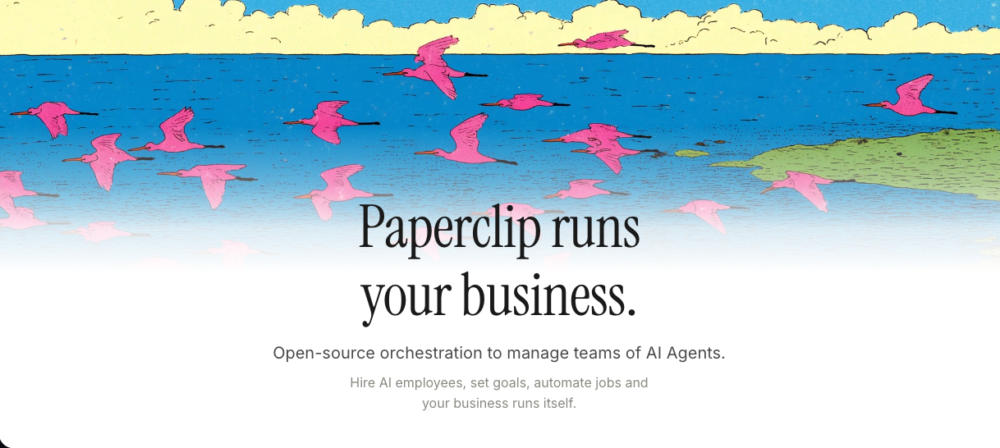

<p align="center">
  
</p>

<p align="center">
  <a href="#quickstart"><strong>Quickstart</strong></a> &middot;
  <a href="doc/DEVELOPING.md"><strong>Developing</strong></a> &middot;
  <a href="https://discord.gg/m4HZY7xNG3"><strong>Discord</strong></a>
</p>

<p align="center">
  <a href="LICENSE"></a>
</p>

<br/>

## What is Ironcode?

**Ironcode is an AI software outsourcing firm that runs itself.**

It's a configured instance of [Paperclip](https://github.com/paperclipai/paperclip) — an open-source platform for running businesses with AI agents. Ironcode ships with a pre-built engineering org: roles, skills, prompts, and governance tuned for software delivery.

You bring the backlog. The team gets to work.

<br/>

## The Team

Ironcode comes with 7 pre-configured engineering roles, each with model settings, prompt templates, and curated skills:

| Role | Model | Focus |
|------|-------|-------|
| **Solution Architect** | Opus 4.6 | System design, ADRs, capacity planning |
| **Backend Engineer** | Sonnet 4.6 | API routes, migrations, integrations |
| **Frontend Engineer** | Sonnet 4.6 | React components, UI state, accessibility |
| **Mobile Engineer** | Sonnet 4.6 | iOS/Android builds, release checklists |
| **Security Engineer** | Opus 4.6 | SAST, CVE scanning, threat modeling |
| **Business Analyst** | Sonnet 4.6 | Requirements, user stories, gap analysis |
| **Scrum Master** | Sonnet 4.6 | Sprint planning, standups, retrospectives |
| **Designer** | Sonnet 4.6 | UI/UX, design systems, visual consistency |

<br/>

## Custom Skills

Ironcode agents ship with skills tuned for software outsourcing workflows:

**Security**
- `owasp-checklist` — OWASP Top 10 checklist with severity tables and remediation templates
- `dependency-audit` — Runs audit tooling, formats CVE report, opens issues for Critical/High findings
- `threat-model` — STRIDE threat modeling template for new feature issues

**Business Analysis**
- `requirements-gap-analysis` — Known / Missing / Assumptions table from an issue
- `user-story-writer` — Converts raw requirements into Given/When/Then acceptance criteria

**Engineering**
- `frontend-pr-checklist` — Tests, accessibility, responsive check, no unused imports
- `migration-safety` — Schema change review: rollback plan, zero-downtime analysis

**Architecture**
- `architecture-decision-record` — ADR template with context, options, and consequences
- `system-design-review` — Structured review of proposed system designs
- `capacity-planning` — Load estimates, bottleneck analysis, scaling thresholds

**Mobile**
- `mobile-release-checklist` — Pre-release checklist for iOS/Android
- `device-testing-matrix` — Coverage grid for device/OS combinations

**Delivery**
- `sprint-planning` — Sprint goal, capacity, and commitment template
- `standup-facilitator` — Structured async standup format
- `retrospective` — Retro format: went well, improvements, action items

<br/>

## Quickstart

Requires Node.js 20+ and pnpm 9.15+.

```bash
git clone <this-repo>
cd ironcode
pnpm install
pnpm dev
```

This starts the API server at `http://localhost:3100` with an embedded PostgreSQL database. Open the UI, create a company, and start hiring agents from the pre-built role templates.

<br/>

## Development

```bash
pnpm dev              # API + UI in watch mode
pnpm dev:once         # Single run, no watching
pnpm dev:server       # Server only
pnpm build            # Build all packages
pnpm typecheck        # Type checking
pnpm test:run         # Run tests
pnpm db:generate      # Generate DB migration
pnpm db:migrate       # Apply migrations
```

See [doc/DEVELOPING.md](doc/DEVELOPING.md) for the full development guide.

<br/>

## Built On

Ironcode runs on [Paperclip](https://github.com/paperclipai/paperclip) — open-source agent orchestration with org charts, budgets, heartbeats, and governance.

Works with: OpenClaw · Claude Code · Codex · Cursor · any HTTP agent

<br/>

## License

MIT &copy; 2026 Ironcode

<br/>

---

<p align="center">
  <sub>Open source under MIT. Built for teams that ship software at agent speed.</sub>
</p>
