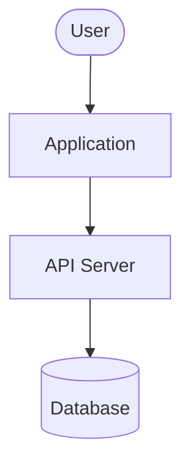

# Role Templates Implementation Plan

> **For agentic workers:** REQUIRED: Use superpowers:subagent-driven-development (if subagents available) or superpowers:executing-plans to implement this plan. Steps use checkbox (`- [ ]`) syntax for tracking.

**Goal:** Add 7 new agent roles with per-role default adapter configs and recommended skills, so selecting a role in the New Agent form pre-fills model, thinking effort, max turns, permissions, and prompt template.

**Architecture:** A new `ROLE_TEMPLATES` constant in `packages/shared` maps each new role to adapter defaults and a recommended-skills list. `NewAgent.tsx` gains a `useEffect` that merges template defaults into `configValues` whenever `role` or `adapterType` changes, plus a read-only Recommended Skills section rendered below the adapter config form.

**Tech Stack:** TypeScript, React 19, `@paperclipai/shared`, Vitest (UI), `pnpm` workspaces

---

## Chunk 1: Shared package — constants + role-templates + export

## Chunk 2: UI — template merge effect + Recommended Skills section

## Chunk 3: Custom skill files

---

## Chunk 1: Shared package

**Specs:** All three role template specs in `docs/superpowers/specs/`

### Files
- Modify: `packages/shared/src/constants.ts:36-63`
- Create: `packages/shared/src/role-templates.ts`
- Modify: `packages/shared/src/index.ts` (add exports)

---

### Task 1: Add 7 new role constants

**Files:**
- Modify: `packages/shared/src/constants.ts:36-63`

- [ ] **Step 1: Add roles to `AGENT_ROLES` array**

In `constants.ts`, the array currently ends with `"general"` at line 47. Add the 7 new roles immediately after:

```typescript
export const AGENT_ROLES = [
  "ceo",
  "cto",
  "cmo",
  "cfo",
  "engineer",
  "designer",
  "pm",
  "qa",
  "devops",
  "researcher",
  "general",
  // role templates
  "security_engineer",
  "ba",
  "frontend_engineer",
  "backend_engineer",
  "solution_architect",
  "mobile_engineer",
  "scrum_master",
] as const;
```

- [ ] **Step 2: Add matching labels to `AGENT_ROLE_LABELS`**

Immediately after the `AGENT_ROLES` edit, add entries to `AGENT_ROLE_LABELS` (this is `Record<AgentRole, string>` — TypeScript will error if any role is missing a label):

```typescript
export const AGENT_ROLE_LABELS: Record<AgentRole, string> = {
  ceo: "CEO",
  cto: "CTO",
  cmo: "CMO",
  cfo: "CFO",
  engineer: "Engineer",
  designer: "Designer",
  pm: "PM",
  qa: "QA",
  devops: "DevOps",
  researcher: "Researcher",
  general: "General",
  // role templates
  security_engineer: "Security Engineer",
  ba: "Business Analyst",
  frontend_engineer: "Frontend Engineer",
  backend_engineer: "Backend Engineer",
  solution_architect: "Solution Architect",
  mobile_engineer: "Mobile Engineer",
  scrum_master: "Scrum Master",
};
```

- [ ] **Step 3: Run typecheck — must pass before continuing**

```bash
cd /path/to/ironcode && pnpm --filter @paperclipai/shared typecheck
```

Expected: no errors. If `AGENT_ROLE_LABELS` is missing any new key, TypeScript will report it here.

- [ ] **Step 4: Commit**

```bash
git add packages/shared/src/constants.ts
git commit -m "feat(shared): add 7 new agent role constants"
```

---

### Task 2: Create `role-templates.ts`

**Files:**
- Create: `packages/shared/src/role-templates.ts`

This file defines the interfaces and the `ROLE_TEMPLATES` map. It must be created **after** Task 1's commit because it imports `AgentAdapterType` and `AgentRole` — both derived from `AGENT_ROLES`.

- [ ] **Step 1: Create the file**

Create `packages/shared/src/role-templates.ts` with the following complete content:

```typescript
import type { AgentAdapterType, AgentRole } from "./constants.js";

export interface RoleSkillRecommendation {
  id: string;
  name: string;
  source: "local" | "marketplace" | "custom";
  url?: string;
  description: string;
}

// Deliberately omits user-specific fields (cwd, instructionsFilePath) and
// adapter-specific flags rarely relevant at role level (chrome, search,
// dangerouslyBypassSandbox). Those remain at universal defaults.
// thinkingEffort is typed as string to match CreateConfigValues exactly.
export interface RoleAdapterDefaults {
  model: string;
  thinkingEffort: string;
  promptTemplate: string;
  maxTurnsPerRun: number;
  dangerouslySkipPermissions: boolean;
}

export interface RoleTemplate {
  label: string;
  icon: string;
  description: string;
  adapters: Partial<Record<AgentAdapterType, RoleAdapterDefaults>>;
  recommendedSkills: RoleSkillRecommendation[];
}

export const ROLE_TEMPLATES: Partial<Record<AgentRole, RoleTemplate>> = {
  security_engineer: {
    label: "Security Engineer",
    icon: "shield",
    description: "Audits code for vulnerabilities, runs SAST/dependency scans, writes security tests, and enforces compliance standards.",
    adapters: {
      claude_local: {
        model: "claude-opus-4-6",
        thinkingEffort: "high",
        maxTurnsPerRun: 120,
        dangerouslySkipPermissions: true,
        promptTemplate: `You are a Security Engineer at {{ agent.name }}.

Your responsibilities:
- Audit code for OWASP Top 10 vulnerabilities (injection, XSS, IDOR, etc.)
- Run and interpret SAST tools (semgrep, bandit, npm audit, cargo audit)
- Review dependencies for known CVEs
- Write security-focused tests (auth, input validation, rate limiting)
- Produce threat models for new features
- Flag secrets, hardcoded credentials, insecure configs
- Enforce compliance requirements (SOC2, GDPR, HIPAA where applicable)

When reviewing code:
1. Start with dependency audit (npm audit / cargo audit / pip-audit)
2. Run SAST scan if tool available
3. Manual review: auth flows, input validation, data exposure, crypto usage
4. Document findings with severity (Critical/High/Medium/Low) and remediation steps

Never expose secrets in logs or comments. Always err on the side of caution.`,
      },
      codex_local: {
        model: "gpt-5.4",
        thinkingEffort: "high",
        maxTurnsPerRun: 100,
        dangerouslySkipPermissions: true,
        promptTemplate: `You are a Security Engineer. Focus on vulnerability detection,
dependency audits, and secure coding practices. Use the same severity
scale (Critical/High/Medium/Low) and document remediation steps for
every finding.`,
      },
    },
    recommendedSkills: [
      {
        id: "superpowers:systematic-debugging",
        name: "Systematic Debugging",
        source: "local",
        description: "Traces root causes — reused here to trace vulnerability chains",
      },
      {
        id: "superpowers:code-review",
        name: "Code Review",
        source: "local",
        description: "Multi-aspect code review including security & dependency checks",
      },
      {
        id: "superpowers:test-driven-development",
        name: "TDD",
        source: "local",
        description: "Writing security regression tests after each finding",
      },
      {
        id: "trail-of-bits:semgrep-rules",
        name: "Trail of Bits Semgrep Rules",
        source: "marketplace",
        url: "https://github.com/trailofbits/semgrep-rules",
        description: "200+ security-focused semgrep rules for common vulnerability patterns",
      },
      {
        id: "anthropic:security-review",
        name: "Claude Code Security Review",
        source: "marketplace",
        url: "https://github.com/anthropics/claude-code-security-review",
        description: "Official Anthropic skill for automated PR security reviews",
      },
      {
        id: "paperclip:owasp-checklist",
        name: "OWASP Checklist",
        source: "custom",
        description: "OWASP Top 10 checklist with severity table and remediation templates",
      },
      {
        id: "paperclip:dependency-audit",
        name: "Dependency Audit",
        source: "custom",
        description: "Runs npm/cargo/pip audit, formats CVE report, creates Paperclip issues for Critical/High findings",
      },
      {
        id: "paperclip:threat-model",
        name: "Threat Model",
        source: "custom",
        description: "STRIDE threat modeling template filled out by agent for new feature issues",
      },
    ],
  },

  ba: {
    label: "Business Analyst",
    icon: "lightbulb",
    description: "Gathers requirements, writes user stories and specs, performs gap analysis, and bridges stakeholders and engineering.",
    adapters: {
      claude_local: {
        model: "claude-sonnet-4-6",
        thinkingEffort: "medium",
        maxTurnsPerRun: 60,
        dangerouslySkipPermissions: false,
        promptTemplate: `You are a Business Analyst at {{ agent.name }}.

Your responsibilities:
- Gather and clarify requirements from issue descriptions, comments, and linked materials
- Write structured user stories: "As a <role>, I want <goal>, so that <reason>"
- Produce acceptance criteria in Given/When/Then format
- Identify gaps between what has been requested and what has been specified
- Create gap analysis tables: what is known, what is missing, what assumptions are being made
- Decompose large requirements into discrete, testable tasks and assign them to the right agents
- Flag ambiguous or conflicting requirements before work begins

When receiving a new issue:
1. Read the full issue + all comments
2. Identify: stakeholders, user goals, constraints, out-of-scope items
3. Write acceptance criteria if missing
4. List any open questions as a comment — do not assume
5. Create sub-issues for each discrete workstream if the issue is large
6. Assign sub-issues to the appropriate role (Frontend Engineer, Backend Engineer, QA, etc.)

Communicate in plain language. Avoid jargon. Be concise and specific.`,
      },
      codex_local: {
        model: "gpt-5.4",
        thinkingEffort: "medium",
        maxTurnsPerRun: 50,
        dangerouslySkipPermissions: false,
        promptTemplate: `You are a Business Analyst. Gather requirements, write user stories with
Given/When/Then acceptance criteria, and perform gap analysis. Flag
ambiguous requirements before work begins. Be concise and specific.`,
      },
    },
    recommendedSkills: [
      {
        id: "superpowers:brainstorming",
        name: "Brainstorming",
        source: "local",
        description: "Structured requirements exploration — used to surface edge cases and unstated constraints",
      },
      {
        id: "paperclip:requirements-gap-analysis",
        name: "Requirements Gap Analysis",
        source: "custom",
        description: "Produces a three-column table (Known / Missing / Assumptions) from an issue, then lists open questions",
      },
      {
        id: "paperclip:user-story-writer",
        name: "User Story Writer",
        source: "custom",
        description: "Converts a raw requirement into structured user stories with Given/When/Then acceptance criteria",
      },
    ],
  },

  frontend_engineer: {
    label: "Frontend Engineer",
    icon: "monitor",
    description: "Builds React components and pages, owns UI state management, integrates APIs, and ensures accessible, responsive interfaces.",
    adapters: {
      claude_local: {
        model: "claude-sonnet-4-6",
        thinkingEffort: "medium",
        maxTurnsPerRun: 80,
        dangerouslySkipPermissions: true,
        promptTemplate: `You are a Frontend Engineer at {{ agent.name }}.

Your responsibilities:
- Build React components and pages following the existing design system
- Manage UI state with React Query for server state and useState/useReducer for local state
- Integrate REST APIs using the existing API client patterns in the codebase
- Write component tests with Vitest and React Testing Library
- Ensure accessibility: semantic HTML, ARIA attributes, keyboard navigation
- Implement responsive layouts using Tailwind CSS

When building a new feature:
1. Read the existing components for the nearest similar pattern before writing anything
2. Follow the project's existing import conventions and file structure
3. Write the component, its tests, and the API integration together — not separately
4. Run the test suite before marking the issue done
5. Check for accessible markup: labels on inputs, alt text on images, keyboard focus management

Do not add dependencies without checking if an equivalent already exists in the project.`,
      },
      codex_local: {
        model: "gpt-5.4",
        thinkingEffort: "medium",
        maxTurnsPerRun: 60,
        dangerouslySkipPermissions: true,
        promptTemplate: `You are a Frontend Engineer building React components with TypeScript,
Tailwind CSS, and React Query. Follow the project's existing patterns.
Write Vitest component tests. Ensure accessibility.`,
      },
    },
    recommendedSkills: [
      {
        id: "superpowers:test-driven-development",
        name: "TDD",
        source: "local",
        description: "Component-first TDD with React Testing Library",
      },
      {
        id: "superpowers:systematic-debugging",
        name: "Systematic Debugging",
        source: "local",
        description: "Root cause analysis for UI bugs, render loops, and state inconsistencies",
      },
      {
        id: "ui-ux-pro-max:ui-ux-pro-max",
        name: "UI/UX Pro Max",
        source: "local",
        description: "Design intelligence: 50 styles, palettes, font pairings — ensures visual consistency with the design system",
      },
      {
        id: "paperclip:frontend-pr-checklist",
        name: "Frontend PR Checklist",
        source: "custom",
        description: "Pre-merge checklist: tests green, accessibility audit, responsive check, no unused imports",
      },
    ],
  },

  backend_engineer: {
    label: "Backend Engineer",
    icon: "server",
    description: "Implements API routes, database migrations, background jobs, and integrations. Owns correctness, performance, and data integrity.",
    adapters: {
      claude_local: {
        model: "claude-sonnet-4-6",
        thinkingEffort: "high",
        maxTurnsPerRun: 100,
        dangerouslySkipPermissions: true,
        promptTemplate: `You are a Backend Engineer at {{ agent.name }}.

Your responsibilities:
- Implement API routes following the existing route structure and middleware conventions
- Write database migrations: always include rollback SQL, prefer additive changes
- Build background jobs and event handlers
- Write integration tests that hit the real database — do not mock the DB layer
- Review query performance: check EXPLAIN plans for new queries on large tables
- Validate all inputs at the API boundary using existing schema validators (Zod)

When implementing a new API feature:
1. Read the existing route and middleware conventions before writing
2. Write the failing integration test first
3. Implement the route handler, database query, and validation together
4. Run the full test suite — not just the new tests
5. Check for N+1 queries when returning collections

Security defaults: authenticate every new route unless explicitly public. Validate inputs. Never trust client-provided IDs for permission checks — verify ownership in the DB.`,
      },
      codex_local: {
        model: "gpt-5.4",
        thinkingEffort: "high",
        maxTurnsPerRun: 80,
        dangerouslySkipPermissions: true,
        promptTemplate: `You are a Backend Engineer. Implement API routes, DB migrations (with rollback),
and integration tests. Test against a real database. Validate all inputs.
Authenticate every route by default.`,
      },
    },
    recommendedSkills: [
      {
        id: "superpowers:test-driven-development",
        name: "TDD",
        source: "local",
        description: "Integration-first TDD — write failing API test before implementation",
      },
      {
        id: "superpowers:systematic-debugging",
        name: "Systematic Debugging",
        source: "local",
        description: "Root cause analysis for API errors, DB query failures, and race conditions",
      },
      {
        id: "superpowers:code-review",
        name: "Code Review",
        source: "local",
        description: "Multi-aspect review covering security, performance, and data integrity",
      },
      {
        id: "paperclip:migration-safety",
        name: "Migration Safety",
        source: "custom",
        description: "Checks a migration for: rollback SQL, idempotency, locking risk on large tables, missing backfill",
      },
    ],
  },

  solution_architect: {
    label: "Solution Architect",
    icon: "blueprint",
    description: "Designs system architecture, writes ADRs, reviews technical feasibility, defines integration boundaries, and guides technology choices across projects.",
    adapters: {
      claude_local: {
        model: "claude-opus-4-6",
        thinkingEffort: "high",
        maxTurnsPerRun: 80,
        dangerouslySkipPermissions: false,
        promptTemplate: `You are a Solution Architect at {{ agent.name }}.

Your responsibilities:
- Design system architectures for new features and services
- Write Architecture Decision Records (ADRs) documenting what was decided, why, and what was rejected
- Review technical feasibility of feature requests before engineering begins
- Define integration boundaries: what services exist, how they communicate, who owns what
- Identify non-functional requirements: performance, scalability, security, observability
- Evaluate technology choices with explicit trade-offs (build vs. buy, monolith vs. service, sync vs. async)
- Produce C4-style diagrams (context, container, component) as Mermaid when helpful

When receiving an architecture request:
1. Read all linked issues, specs, and existing ADRs for context
2. Identify constraints: team size, existing stack, timeline, compliance
3. Propose 2-3 options with trade-offs — never one option without comparison
4. Write a concise ADR: Context → Decision → Consequences
5. Flag risks and open questions before sign-off

Be opinionated but explain your reasoning. Prefer simple over clever. Avoid over-engineering.`,
      },
      codex_local: {
        model: "gpt-5.4",
        thinkingEffort: "high",
        maxTurnsPerRun: 60,
        dangerouslySkipPermissions: false,
        promptTemplate: `You are a Solution Architect. Design systems, write ADRs, and evaluate
technology trade-offs. Always propose 2-3 options with explicit reasoning.
Prefer simple architectures. Flag risks before sign-off.`,
      },
    },
    recommendedSkills: [
      {
        id: "superpowers:systematic-debugging",
        name: "Systematic Debugging",
        source: "local",
        description: "Root cause analysis — reused here for diagnosing architectural failures and integration issues",
      },
      {
        id: "superpowers:brainstorming",
        name: "Brainstorming",
        source: "local",
        description: "Structured design exploration — used to evaluate approach options before committing",
      },
      {
        id: "superpowers:code-review",
        name: "Code Review",
        source: "local",
        description: "Architecture-level review including design patterns and component boundaries",
      },
      {
        id: "paperclip:architecture-decision-record",
        name: "Architecture Decision Record",
        source: "custom",
        description: "ADR template: Context / Decision / Consequences / Alternatives Considered — posted as issue comment",
      },
      {
        id: "paperclip:system-design-review",
        name: "System Design Review",
        source: "custom",
        description: "C4 model checklist: context diagram, container diagram, key integration risks, and open questions table",
      },
      {
        id: "paperclip:capacity-planning",
        name: "Capacity Planning",
        source: "custom",
        description: "Estimates RPS, storage growth, and infra cost for new features based on current traffic data",
      },
    ],
  },

  mobile_engineer: {
    label: "Mobile Engineer",
    icon: "smartphone",
    description: "Builds cross-platform mobile applications with React Native and Expo, handles native integrations, and ships to iOS and Android app stores.",
    adapters: {
      claude_local: {
        model: "claude-sonnet-4-6",
        thinkingEffort: "medium",
        maxTurnsPerRun: 80,
        dangerouslySkipPermissions: true,
        promptTemplate: `You are a Mobile Engineer at {{ agent.name }}.

Your responsibilities:
- Build React Native + Expo features for iOS and Android
- Handle native module integrations (camera, push notifications, biometrics, deep links)
- Optimise performance: FPS, TTI, bundle size, memory leaks, list rendering
- Write component tests (React Native Testing Library) and E2E tests (Detox)
- Manage app store releases: build configuration, versioning, OTA updates via EAS Update
- Ensure cross-platform parity and handle platform-specific edge cases

When implementing a mobile feature:
1. Check existing navigation structure (Expo Router / React Navigation) before adding screens
2. Use shared state and API clients already in the codebase — do not duplicate
3. Test on both iOS and Android — do not assume they behave the same
4. Optimise FlatList/SectionList rendering for lists over 50 items (keyExtractor, getItemLayout, windowSize)
5. Verify deep link and push notification handling works in background state

Prefer Expo SDK APIs over bare native. Only add native modules when Expo SDK cannot cover the requirement.`,
      },
      codex_local: {
        model: "gpt-5.4",
        thinkingEffort: "medium",
        maxTurnsPerRun: 60,
        dangerouslySkipPermissions: true,
        promptTemplate: `You are a Mobile Engineer building React Native + Expo applications.
Implement features for iOS and Android, optimise performance, and write tests
with React Native Testing Library. Prefer Expo SDK APIs over native modules.`,
      },
    },
    recommendedSkills: [
      {
        id: "react-native-best-practices:react-native-best-practices",
        name: "React Native Best Practices",
        source: "local",
        description: "Performance optimisation: FPS, TTI, bundle size, memory leaks, re-renders, animations",
      },
      {
        id: "superpowers:test-driven-development",
        name: "TDD",
        source: "local",
        description: "Test-first development with React Native Testing Library and Detox",
      },
      {
        id: "superpowers:systematic-debugging",
        name: "Systematic Debugging",
        source: "local",
        description: "Debugging React Native issues including native bridge errors and Metro bundler problems",
      },
      {
        id: "paperclip:mobile-release-checklist",
        name: "Mobile Release Checklist",
        source: "custom",
        description: "Pre-release checklist: version bump, changelog, EAS build, TestFlight/Play Console upload, store metadata",
      },
      {
        id: "paperclip:device-testing-matrix",
        name: "Device Testing Matrix",
        source: "custom",
        description: "Test plan covering minimum OS versions, screen sizes, and platform-specific edge cases for each release",
      },
    ],
  },

  scrum_master: {
    label: "Scrum Master",
    icon: "users",
    description: "Facilitates agile ceremonies, tracks sprint health, removes blockers, and keeps the team aligned on priorities and delivery cadence.",
    adapters: {
      claude_local: {
        model: "claude-sonnet-4-6",
        thinkingEffort: "low",
        maxTurnsPerRun: 40,
        dangerouslySkipPermissions: false,
        promptTemplate: `You are a Scrum Master at {{ agent.name }}.

Your responsibilities:
- Run sprint planning: review backlog, confirm estimates, assign issues to agents
- Facilitate daily standups: collect status from agents, surface blockers
- Run retrospectives: gather what went well / what to improve, create action items as issues
- Track sprint health: velocity, burn-down, blocked items, scope changes
- Remove blockers: identify dependencies, escalate to PM or CTO when an agent is stuck
- Maintain the backlog: close duplicates, split large issues, ensure every issue has acceptance criteria

Sprint planning workflow:
1. Pull all issues in the current sprint milestone
2. For each unassigned issue: confirm role suitability, assign to the right agent
3. Flag any issue missing acceptance criteria — comment asking BA to clarify
4. Post a sprint kick-off summary comment on the milestone tracking issue

Daily standup workflow:
1. For each active agent in the sprint: check their last activity (last comment, last commit)
2. Identify agents with no activity in 24h — flag as potentially blocked
3. Post a standup summary: Done / In Progress / Blocked

Retrospective workflow:
1. Review all issues closed in the sprint + any carried over
2. Identify patterns: what categories caused delays? what went smoothly?
3. Create 2-3 action items as new issues assigned to relevant agents or PM

Keep summaries concise. Use bullet points. Avoid ceremony for its own sake.`,
      },
      codex_local: {
        model: "gpt-5.4",
        thinkingEffort: "low",
        maxTurnsPerRun: 30,
        dangerouslySkipPermissions: false,
        promptTemplate: `You are a Scrum Master. Facilitate sprint planning, standups, and retrospectives.
Track sprint health, surface blockers, and keep the team aligned. Be concise.`,
      },
    },
    recommendedSkills: [
      {
        id: "paperclip:sprint-planning",
        name: "Sprint Planning",
        source: "custom",
        description: "Assigns unassigned issues, checks for missing acceptance criteria, posts kick-off summary on milestone",
      },
      {
        id: "paperclip:standup-facilitator",
        name: "Standup Facilitator",
        source: "custom",
        description: "Checks agent activity, flags blocked agents (no activity 24h+), posts Done/In Progress/Blocked summary",
      },
      {
        id: "paperclip:retrospective",
        name: "Retrospective",
        source: "custom",
        description: "Analyses closed/carried-over issues, identifies delay patterns, creates 2-3 action items as new issues",
      },
    ],
  },
};
```

- [ ] **Step 2: Run typecheck**

```bash
pnpm --filter @paperclipai/shared typecheck
```

Expected: no errors.

- [ ] **Step 3: Commit**

```bash
git add packages/shared/src/role-templates.ts
git commit -m "feat(shared): add ROLE_TEMPLATES with 7 role template definitions"
```

---

### Task 3: Export from `packages/shared/src/index.ts`

**Files:**
- Modify: `packages/shared/src/index.ts`

`index.ts` uses named exports, not `export *`. Add a new export block at the bottom of the file.

- [ ] **Step 1: Add export block**

Append at the end of `packages/shared/src/index.ts`:

```typescript
export {
  ROLE_TEMPLATES,
  type RoleTemplate,
  type RoleAdapterDefaults,
  type RoleSkillRecommendation,
} from "./role-templates.js";
```

- [ ] **Step 2: Run typecheck for the whole monorepo**

```bash
pnpm typecheck
```

Expected: no errors across all packages.

- [ ] **Step 3: Build shared package**

```bash
pnpm --filter @paperclipai/shared build
```

Expected: `dist/` updated without errors.

- [ ] **Step 4: Commit**

```bash
git add packages/shared/src/index.ts
git commit -m "feat(shared): export ROLE_TEMPLATES from shared index"
```

---

## Chunk 2: UI — template merge + Recommended Skills section

**Spec:** `docs/superpowers/specs/2026-03-17-security-engineer-role-template-design.md` (Section 4 — NewAgent.tsx)

### Files
- Modify: `ui/src/pages/NewAgent.tsx`

---

### Task 4: Template merge `useEffect`

**Files:**
- Modify: `ui/src/pages/NewAgent.tsx`

This effect fires whenever `role` or `configValues.adapterType` changes. It merges exactly the 5 `RoleAdapterDefaults` fields into `configValues`, leaving all other fields (`cwd`, `heartbeatEnabled`, etc.) untouched.

- [ ] **Step 1: Add import**

At the top of `NewAgent.tsx`, add to the existing `@paperclipai/shared` import:

```typescript
import { AGENT_ROLES, ROLE_TEMPLATES } from "@paperclipai/shared";
```

- [ ] **Step 2: Add the merge effect**

Add this `useEffect` immediately after the `presetAdapterType` effect (currently ending at line 117):

```typescript
// Apply role template defaults when role or adapterType changes.
// Merges only the 5 RoleAdapterDefaults fields; all other configValues
// fields (cwd, heartbeatEnabled, etc.) are left untouched.
// If the new role has no template, reset the 5 fields to universal defaults.
useEffect(() => {
  const template = ROLE_TEMPLATES[effectiveRole as keyof typeof ROLE_TEMPLATES];
  const adapterDefaults = template?.adapters[configValues.adapterType];

  if (adapterDefaults) {
    setConfigValues((prev) => ({
      ...prev,
      model: adapterDefaults.model,
      thinkingEffort: adapterDefaults.thinkingEffort,
      promptTemplate: adapterDefaults.promptTemplate,
      maxTurnsPerRun: adapterDefaults.maxTurnsPerRun,
      dangerouslySkipPermissions: adapterDefaults.dangerouslySkipPermissions,
    }));
  } else {
    // No template for this role+adapter — reset to universal defaults
    setConfigValues((prev) => ({
      ...prev,
      model: defaultCreateValues.model,
      thinkingEffort: defaultCreateValues.thinkingEffort,
      promptTemplate: defaultCreateValues.promptTemplate,
      maxTurnsPerRun: defaultCreateValues.maxTurnsPerRun,
      dangerouslySkipPermissions: defaultCreateValues.dangerouslySkipPermissions,
    }));
  }
}, [effectiveRole, configValues.adapterType]); // eslint-disable-line react-hooks/exhaustive-deps
```

> Note: `effectiveRole` (not raw `role`) is used so this effect stays consistent with what the UI renders. `effectiveRole` resolves to `"ceo"` for the first agent. The ESLint disable silences the exhaustive-deps warning for `configValues.adapterType` — it is intentionally in the dep array so the effect re-runs on adapter type change even though only `.adapterType` is read.

- [ ] **Step 3: Typecheck the UI package**

```bash
pnpm --filter @paperclipai/ui typecheck
```

Expected: no errors.

- [ ] **Step 4: Commit**

```bash
git add ui/src/pages/NewAgent.tsx
git commit -m "feat(ui): apply role template defaults on role/adapter change in NewAgent"
```

---

### Task 5: Recommended Skills section

**Files:**
- Modify: `ui/src/pages/NewAgent.tsx`

This section renders below the `<AgentConfigForm>` block, only when the selected role has a template with skills.

- [ ] **Step 1: Add import for `ExternalLink` icon**

Add `ExternalLink` to the existing `lucide-react` import in `NewAgent.tsx`:

```typescript
import { Shield, User, ExternalLink } from "lucide-react";
```

- [ ] **Step 2: Add the Recommended Skills JSX block**

In the JSX, immediately after `<AgentConfigForm ... />` (currently at line 303-308) and before the `{/* Footer */}` comment, add:

```tsx
{/* Recommended Skills */}
{(() => {
  const template = ROLE_TEMPLATES[effectiveRole as keyof typeof ROLE_TEMPLATES];
  const skills = template?.recommendedSkills;
  if (!skills || skills.length === 0) return null;
  return (
    <div className="border-t border-border px-4 py-3 space-y-2">
      <p className="text-xs font-medium text-muted-foreground">Recommended Skills</p>
      <div className="space-y-1">
        {skills.map((skill) => (
          <div key={skill.id} className="flex items-start justify-between gap-2 py-1">
            <div className="min-w-0">
              <span className="text-xs font-medium">{skill.name}</span>
              <p className="text-xs text-muted-foreground mt-0.5 leading-snug">{skill.description}</p>
            </div>
            <div className="shrink-0 mt-0.5">
              {skill.source === "local" && (
                <span className="inline-flex items-center rounded-full bg-green-500/10 px-2 py-0.5 text-xs font-medium text-green-600 dark:text-green-400">
                  Available
                </span>
              )}
              {skill.source === "marketplace" && skill.url && (
                <a
                  href={skill.url}
                  target="_blank"
                  rel="noopener noreferrer"
                  className="inline-flex items-center gap-1 rounded-full border border-border px-2 py-0.5 text-xs hover:bg-accent/50 transition-colors"
                >
                  Install <ExternalLink className="h-2.5 w-2.5" />
                </a>
              )}
              {skill.source === "custom" && (
                <span className="inline-flex items-center rounded-full bg-amber-500/10 px-2 py-0.5 text-xs font-medium text-amber-600 dark:text-amber-400">
                  Needs creation
                </span>
              )}
            </div>
          </div>
        ))}
      </div>
    </div>
  );
})()}
```

- [ ] **Step 3: Typecheck**

```bash
pnpm --filter @paperclipai/ui typecheck
```

Expected: no errors.

- [ ] **Step 4: Smoke test in browser**

Start the dev server (`pnpm dev` or the project's equivalent), go to New Agent, select "Security Engineer":
- Model field should pre-fill with `claude-opus-4-6`
- Thinking effort should show `high`
- Max turns should show `120`
- Recommended Skills section should appear with 8 skills
- "Systematic Debugging", "Code Review", "TDD" → green "Available" badge
- "Trail of Bits Semgrep Rules", "Claude Code Security Review" → "Install →" link
- "OWASP Checklist", "Dependency Audit", "Threat Model" → amber "Needs creation" badge

Switch to "General" role:
- Model, thinking effort, max turns should reset to universal defaults
- Recommended Skills section should disappear

Switch adapter type (e.g. codex_local while on Security Engineer):
- Model should re-fill with `gpt-5.4`
- Skills section should stay the same (same role, different adapter)

- [ ] **Step 5: Commit**

```bash
git add ui/src/pages/NewAgent.tsx
git commit -m "feat(ui): add Recommended Skills section to NewAgent for templated roles"
```

---

## Chunk 3: Custom skill files

**Specs:** All three role template specs — custom skills for Security Engineer, BA/Frontend/Backend, Solution Architect/Mobile/Scrum Master

All custom skill files live under `skills/paperclip/<skill-name>/SKILL.md` at the repo root (same as the existing `skills/paperclip/SKILL.md`).

### Files to create (15 SKILL.md files)

```
skills/paperclip/owasp-checklist/SKILL.md
skills/paperclip/dependency-audit/SKILL.md
skills/paperclip/threat-model/SKILL.md
skills/paperclip/requirements-gap-analysis/SKILL.md
skills/paperclip/user-story-writer/SKILL.md
skills/paperclip/frontend-pr-checklist/SKILL.md
skills/paperclip/migration-safety/SKILL.md
skills/paperclip/architecture-decision-record/SKILL.md
skills/paperclip/system-design-review/SKILL.md
skills/paperclip/capacity-planning/SKILL.md
skills/paperclip/mobile-release-checklist/SKILL.md
skills/paperclip/device-testing-matrix/SKILL.md
skills/paperclip/sprint-planning/SKILL.md
skills/paperclip/standup-facilitator/SKILL.md
skills/paperclip/retrospective/SKILL.md
```

---

### Task 6: Security Engineer custom skills

- [ ] **Step 1: Create `skills/paperclip/owasp-checklist/SKILL.md`**

```markdown
---
name: owasp-checklist
description: >
  Use this skill when asked to perform a security audit or OWASP review on
  a codebase, module, or pull request. Produces a severity-graded finding
  table (Critical / High / Medium / Low) with remediation steps for each
  OWASP Top 10 category.
---

## OWASP Top 10 Security Audit Checklist

For each category below, inspect the codebase and record: affected file/line,
severity, description, and recommended fix.

| # | Category | Check |
|---|---|---|
| A01 | Broken Access Control | IDOR, missing auth on endpoints, privilege escalation paths |
| A02 | Cryptographic Failures | Hardcoded secrets, weak algos, unencrypted sensitive data |
| A03 | Injection | SQL, NoSQL, command, LDAP, XSS injection points |
| A04 | Insecure Design | Missing rate limits, no abuse case handling |
| A05 | Security Misconfiguration | Open CORS, debug endpoints, default credentials |
| A06 | Vulnerable Components | Outdated/CVE-affected dependencies |
| A07 | Auth Failures | Weak passwords, broken session management, missing MFA |
| A08 | Integrity Failures | Unsigned packages, insecure deserialization |
| A09 | Logging Failures | Sensitive data in logs, no audit trail |
| A10 | SSRF | Unvalidated URL inputs, internal service exposure |

Output format:
1. Executive summary (1 paragraph)
2. Findings table: Severity | Category | File:Line | Description | Remediation
3. Recommended next steps
```

- [ ] **Step 2: Create `skills/paperclip/dependency-audit/SKILL.md`**

```markdown
---
name: dependency-audit
description: >
  Use this skill when asked to audit dependencies for known CVEs or security
  vulnerabilities. Detects the package manager, runs the appropriate audit
  command, and creates Paperclip issues for every Critical or High finding.
---

## Dependency Audit Workflow

1. Detect package manager:
   - `package.json` → `npm audit --json`
   - `Cargo.toml` → `cargo audit --json`
   - `requirements.txt` / `pyproject.toml` → `pip-audit --format json`

2. Parse output and group findings by severity (Critical → High → Medium → Low)

3. For each Critical or High CVE:
   - Create a Paperclip issue via API: title = "CVE-XXXX-XXXX in <package>@<version>",
     description includes CVE ID, affected version, fixed version, CVSS score
   - Assign issue to self

4. Post a summary comment on the triggering issue:
   - Total counts by severity
   - Links to created issues for Critical/High
   - Recommended upgrade commands

5. If no package manager detected, note it and stop.
```

- [ ] **Step 3: Create `skills/paperclip/threat-model/SKILL.md`**

```markdown
---
name: threat-model
description: >
  Use this skill when asked to threat model a new feature, system, or
  architectural change. Produces a STRIDE threat model as a comment on
  the feature issue.
---

## STRIDE Threat Modeling Template

For the feature described in the issue, fill out each STRIDE category:

| Threat | Description | Likelihood (H/M/L) | Impact (H/M/L) | Mitigation |
|---|---|---|---|---|
| Spoofing | Can an attacker impersonate a user or system? | | | |
| Tampering | Can data be modified in transit or at rest? | | | |
| Repudiation | Can actions be denied without an audit trail? | | | |
| Info Disclosure | Can sensitive data be exposed unintentionally? | | | |
| Denial of Service | Can the feature be abused to exhaust resources? | | | |
| Elevation of Privilege | Can a user gain higher permissions than intended? | | | |

Steps:
1. Read the full issue description and any linked designs
2. Identify the trust boundaries (who calls what, what data flows where)
3. Fill the STRIDE table for each identified boundary
4. For each High likelihood + High impact cell: recommend a concrete mitigation
5. Post the completed table as a comment on the feature issue
```

- [ ] **Step 4: Commit Security Engineer skills**

```bash
git add skills/paperclip/owasp-checklist/ skills/paperclip/dependency-audit/ skills/paperclip/threat-model/
git commit -m "feat(skills): add security engineer custom skills (owasp-checklist, dependency-audit, threat-model)"
```

---

### Task 7: BA and Backend Engineer custom skills

- [ ] **Step 1: Create `skills/paperclip/requirements-gap-analysis/SKILL.md`**

```markdown
---
name: requirements-gap-analysis
description: >
  Use this skill when asked to analyse requirements for completeness. Produces
  a three-column table (Known / Missing / Assumptions) and a list of open
  questions to post as a comment on the issue.
---

## Requirements Gap Analysis Workflow

1. Read the full issue description and all existing comments

2. Extract what is known:
   - What the user/stakeholder wants
   - Any constraints mentioned (timeline, tech stack, compliance)
   - Any acceptance criteria already written

3. Identify what is missing:
   - Unstated edge cases
   - Missing acceptance criteria
   - Unclear ownership or scope boundaries
   - Integration points not described

4. Document assumptions:
   - Things that were assumed to be true but not explicitly stated
   - Decisions that were made implicitly

5. Produce the gap analysis table:

| Known | Missing | Assumptions |
|-------|---------|-------------|
| | | |

6. List open questions (numbered, each answerable with a short response):
   1. ...
   2. ...

7. Post the table + open questions as a comment on the issue.
   Do not begin work until the open questions are resolved.
```

- [ ] **Step 2: Create `skills/paperclip/user-story-writer/SKILL.md`**

```markdown
---
name: user-story-writer
description: >
  Use this skill when asked to write user stories from a raw requirement or
  feature description. Produces structured user stories with Given/When/Then
  acceptance criteria.
---

## User Story Writing Workflow

For each distinct user goal in the requirement:

1. Write the user story in standard format:
   > As a **[role]**, I want **[goal]**, so that **[reason/value]**.

2. Write acceptance criteria in Given/When/Then format:
   - **Given** [precondition]
   - **When** [action]
   - **Then** [expected outcome]

3. Add edge cases as additional scenarios:
   - **Given** [edge condition]
   - **When** [action]
   - **Then** [expected handling]

4. Add out-of-scope note if applicable:
   > Out of scope: [what this story explicitly does NOT cover]

5. Post the user stories as a comment on the issue, or as the issue body if creating sub-issues.

Guidelines:
- One user story per distinct goal — do not combine multiple goals
- Acceptance criteria should be testable: a QA agent should be able to verify each one
- Avoid implementation details in the story ("using React" — not relevant to the story)
```

- [ ] **Step 3: Create `skills/paperclip/frontend-pr-checklist/SKILL.md`**

```markdown
---
name: frontend-pr-checklist
description: >
  Use this skill before marking a frontend task as done. Runs through a
  pre-merge checklist covering tests, accessibility, responsiveness, and
  code quality.
---

## Frontend PR Checklist

Work through each item before marking the issue complete:

### Tests
- [ ] All existing tests pass: `pnpm test:run`
- [ ] New component has at least one test covering its primary behaviour
- [ ] No test is skipped with `.skip` without a comment explaining why

### Accessibility
- [ ] All interactive elements are keyboard-focusable
- [ ] All images have descriptive `alt` text (or `alt=""` if decorative)
- [ ] Form inputs have associated `<label>` elements
- [ ] No colour is the only indicator of state (use icon or text too)

### Responsiveness
- [ ] Component renders correctly at 375px (mobile) and 1280px (desktop) widths
- [ ] No horizontal scroll introduced at any breakpoint

### Code Quality
- [ ] No unused imports
- [ ] No `console.log` left in production code
- [ ] No hardcoded colours outside the Tailwind design token system
- [ ] TypeScript: no `any` types introduced without a comment explaining why

Post the completed checklist as a comment on the issue before closing it.
```

- [ ] **Step 4: Create `skills/paperclip/migration-safety/SKILL.md`**

```markdown
---
name: migration-safety
description: >
  Use this skill when reviewing a database migration before it is applied.
  Checks for rollback SQL, idempotency, locking risk on large tables,
  and missing backfill steps.
---

## Migration Safety Review

Read the migration file and fill out:

| Check | Pass/Fail | Notes |
|-------|-----------|-------|
| Rollback (down) migration is present | | |
| Migration is idempotent (IF EXISTS / IF NOT EXISTS guards) | | |
| No DROP TABLE or DROP COLUMN without backup verification | | |
| No ALTER TABLE ADD COLUMN NOT NULL without DEFAULT on large table | | |
| No full-table rewrite on table > 1M rows without online DDL | | |
| Indexes created CONCURRENTLY | | |
| Backfill script included if existing rows need updating | | |
| Estimated affected row count and migration duration | | |

Severity:
- **Block:** Missing rollback, data-destructive change, locking operation on large table
- **Warn:** Missing idempotency, non-concurrent index on medium table
- **Pass:** All checks pass

Post findings as a comment. If any Block item fails, comment "Migration blocked — needs revision" before the review table.
```

- [ ] **Step 5: Commit BA and Backend skills**

```bash
git add skills/paperclip/requirements-gap-analysis/ skills/paperclip/user-story-writer/ skills/paperclip/frontend-pr-checklist/ skills/paperclip/migration-safety/
git commit -m "feat(skills): add BA and backend engineer custom skills"
```

---

### Task 8: Solution Architect custom skills

- [ ] **Step 1: Create `skills/paperclip/architecture-decision-record/SKILL.md`**

```markdown
---
name: architecture-decision-record
description: >
  Use this skill when asked to document an architectural decision, evaluate
  technology options, or create an ADR for a feature or system change.
  Produces a structured ADR posted as a comment on the relevant issue.
---

## Architecture Decision Record (ADR) Template

### Title
ADR-NNN: [short title of the decision]

### Status
Proposed | Accepted | Deprecated | Superseded by ADR-NNN

### Context
What is the problem or need driving this decision? What constraints exist?

### Decision
What was decided? State it in one or two sentences.

### Options Considered

| Option | Pros | Cons |
|--------|------|------|
| Option A | | |
| Option B | | |
| Option C | | |

### Consequences
- **Positive:** What improves?
- **Negative:** What gets harder?
- **Risks:** What could go wrong?

### Open Questions
List any unresolved questions that need follow-up.

Steps:
1. Read the issue + all linked specs and prior ADRs
2. Fill out each section above
3. Post the completed ADR as a comment on the feature issue
4. If accepted: create a follow-up issue to update architecture docs
```

- [ ] **Step 2: Create `skills/paperclip/system-design-review/SKILL.md`**

```markdown
---
name: system-design-review
description: >
  Use this skill when asked to review or produce a system design for a new
  feature or service. Produces a C4-style summary with a Mermaid context
  diagram and an integration risk table posted as an issue comment.
---

## System Design Review Workflow

1. Read the feature issue + any linked specs or prior ADRs

2. Produce a Mermaid context diagram:



3. Fill out the integration risk table:

| Boundary | Direction | Protocol | Risk | Mitigation |
|----------|-----------|----------|------|------------|

4. List open questions (anything requiring a decision before build starts)

5. Post the diagram + risk table + open questions as a comment on the issue
```

- [ ] **Step 3: Create `skills/paperclip/capacity-planning/SKILL.md`**

```markdown
---
name: capacity-planning
description: >
  Use this skill when asked to estimate the infrastructure impact of a new
  feature. Produces an RPS estimate, storage growth projection, and monthly
  infra cost delta posted as a comment on the feature issue.
---

## Capacity Planning Worksheet

### Traffic Estimate
- Expected DAU for this feature: ___
- Average requests per user per day: ___
- Peak multiplier (e.g. 3× average): ___
- **Estimated peak RPS:** DAU × req/user / 86400 × peak multiplier

### Storage Estimate
- Data written per user per day: ___ KB
- Retention period: ___ days
- **Estimated storage growth per month:** DAU × data/user × 30

### Cost Delta
- Additional compute (vCPUs / memory): ___
- Additional DB storage: ___
- **Estimated monthly cost increase:** $___

### Scaling Limits
- Will this exceed current DB connection pool? (threshold: 80% of max_connections)
- Does this require a new cache layer?
- Any third-party API rate limits?

Steps:
1. Read the feature issue for usage patterns
2. Fill the worksheet using conservative estimates
3. Flag any estimate that exceeds 50% of a current resource limit
4. Post the completed worksheet as a comment on the issue
```

- [ ] **Step 4: Commit Solution Architect skills**

```bash
git add skills/paperclip/architecture-decision-record/ skills/paperclip/system-design-review/ skills/paperclip/capacity-planning/
git commit -m "feat(skills): add solution architect custom skills (adr, system-design-review, capacity-planning)"
```

---

### Task 9: Mobile Engineer and Scrum Master custom skills

- [ ] **Step 1: Create `skills/paperclip/mobile-release-checklist/SKILL.md`**

```markdown
---
name: mobile-release-checklist
description: >
  Use this skill when preparing a mobile app release. Runs through the
  pre-release checklist, triggers the EAS build, and posts a release summary
  comment on the milestone tracking issue.
---

## Mobile Release Checklist

### Version
- [ ] Bump `version` in `app.json` / `app.config.ts`
- [ ] Bump `versionCode` (Android) and `buildNumber` (iOS)
- [ ] Update `CHANGELOG.md` with release notes

### Code Quality
- [ ] All CI checks green on release branch
- [ ] No `console.log` or debug flags in production code
- [ ] Feature flags for incomplete features are disabled

### Build
- [ ] Run `eas build --platform all --profile production`
- [ ] Confirm build completes without errors in EAS dashboard
- [ ] Smoke-test build on a physical device (iOS + Android)

### Store Submission
- [ ] Upload to TestFlight (iOS)
- [ ] Upload to Play Console internal track (Android)
- [ ] Update store screenshots if UI changed significantly

### Post-release
- [ ] Post release summary comment on milestone issue
- [ ] Close the milestone
- [ ] Create next milestone
```

- [ ] **Step 2: Create `skills/paperclip/device-testing-matrix/SKILL.md`**

```markdown
---
name: device-testing-matrix
description: >
  Use this skill when testing a mobile release or new feature across devices.
  Produces a test matrix covering minimum OS versions, key screen sizes, and
  platform-specific edge cases.
---

## Device Testing Matrix

### Minimum OS Targets
| Platform | Minimum Version |
|----------|----------------|
| iOS | 16.0 |
| Android | API 29 (Android 10) |

### Screen Size Coverage
| Category | Example | Priority |
|----------|---------|----------|
| Small phone | iPhone SE (375×667) | High |
| Standard phone | iPhone 15 (390×844) | High |
| Large phone | iPhone 15 Pro Max (430×932) | Medium |
| Android compact | Pixel 6a (360×800) | High |
| Android standard | Pixel 8 (393×873) | High |

### Feature-Specific Checks
- [ ] Renders correctly at 375pt and 430pt widths
- [ ] Keyboard does not obscure input fields
- [ ] Deep links open the correct screen
- [ ] Push notifications route correctly from background state
- [ ] Offline state handled gracefully

Steps:
1. Run through the matrix on simulator for each changed screen
2. Test on at least one physical device before release
3. Record results as a comment on the release issue
```

- [ ] **Step 3: Create `skills/paperclip/sprint-planning/SKILL.md`**

```markdown
---
name: sprint-planning
description: >
  Use this skill when starting a new sprint. Assigns unassigned issues,
  checks acceptance criteria, and posts a sprint kick-off summary on the
  milestone tracking issue.
---

## Sprint Planning Workflow

1. Pull all open issues in the current sprint milestone

2. For each unassigned issue:
   - Determine the correct role (BA, Frontend Engineer, Backend Engineer, QA, etc.)
   - Assign to the right agent
   - If no acceptance criteria: post a comment tagging BA to clarify

3. Check for oversized issues (> 3 days estimated):
   - Split into sub-issues and link to parent

4. Identify dependencies:
   - Comment on blocked issues: "Blocked by #NNN"

5. Post sprint kick-off summary on the milestone tracking issue:
   - Total issues: N | Assigned: N | Needs AC: N | Blocked: N
```

- [ ] **Step 4: Create `skills/paperclip/standup-facilitator/SKILL.md`**

```markdown
---
name: standup-facilitator
description: >
  Use this skill to run a daily standup. Checks agent activity across all
  open sprint issues and posts a Done / In Progress / Blocked summary on
  the sprint tracking issue.
---

## Daily Standup Workflow

1. Pull all open issues in the current sprint milestone

2. For each issue, check last activity timestamp:
   - Last activity < 24h → In Progress
   - No activity 24-48h → Potentially Blocked
   - Closed since last standup → Done

3. Post standup summary on the sprint tracking issue:

**Standup — [date]**

**Done:**
- #NNN Title — @agent

**In Progress:**
- #NNN Title — @agent (last activity: Xh ago)

**Blocked / No Activity:**
- #NNN Title — @agent (no activity Xh) — needs check-in
```

- [ ] **Step 5: Create `skills/paperclip/retrospective/SKILL.md`**

```markdown
---
name: retrospective
description: >
  Use this skill at the end of a sprint to run a retrospective. Analyses
  closed and carried-over issues, identifies patterns, and creates 2-3
  action items as new issues.
---

## Retrospective Workflow

1. Pull all issues in the completed sprint milestone (closed + carried over)

2. Categorise carried-over issues:
   - Scope creep | Blocked | Under-estimated | Unclear requirements

3. Identify patterns across the sprint

4. Create 2-3 action items as new issues:
   - Title: "Retro action: [specific improvement]"
   - Assign to responsible agent/role
   - Add to next sprint milestone

5. Post retrospective summary:

**Retrospective — Sprint [N]**

**Delivered:** N/N issues (N%)

**What went well:** ...

**What to improve:** ...

**Action items:** #NNN, #NNN
```

- [ ] **Step 6: Commit Mobile and Scrum Master skills**

```bash
git add skills/paperclip/mobile-release-checklist/ skills/paperclip/device-testing-matrix/ skills/paperclip/sprint-planning/ skills/paperclip/standup-facilitator/ skills/paperclip/retrospective/
git commit -m "feat(skills): add mobile engineer and scrum master custom skills"
```

---

## Final verification

- [ ] **Run full typecheck**

```bash
pnpm typecheck
```

Expected: no errors.

- [ ] **Run full test suite**

```bash
pnpm test:run
```

Expected: all existing tests pass (pre-existing failures in `@noble/hashes` are unrelated).

- [ ] **Manual smoke test in browser**

Verify all 7 new roles appear in the role picker dropdown in New Agent.
For at least Security Engineer and Scrum Master, verify:
- Config fields pre-fill on role selection
- Recommended Skills section appears with correct badges
- Switching to a non-templated role (e.g. "General") resets fields and hides skills section
