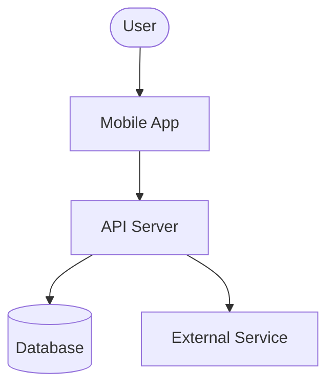

# Solution Architect, Mobile Engineer, Scrum Master Role Templates Design

**Goal:** Add three new agent roles — Solution Architect (`solution_architect`), Mobile Engineer (`mobile_engineer`), Scrum Master (`scrum_master`) — each with a default adapter config template and recommended skills, using the role template architecture established in the Security Engineer spec.

**Date:** 2026-03-17

**Prerequisite:** The role template architecture (`RoleTemplate`, `ROLE_TEMPLATES`, `RoleAdapterDefaults`) is defined in the Security Engineer spec (`2026-03-17-security-engineer-role-template-design.md`). This spec only adds entries to `ROLE_TEMPLATES` and new role constants — it does not change the architecture.

---

## Role Constants

### Add to `AGENT_ROLES` in `packages/shared/src/constants.ts`

```typescript
"solution_architect",
"mobile_engineer",
"scrum_master",
```

### Add to `AGENT_ROLE_LABELS`

```typescript
solution_architect: "Solution Architect",
mobile_engineer: "Mobile Engineer",
scrum_master: "Scrum Master",
```

> **Constraint:** `AGENT_ROLE_LABELS` is typed as `Record<AgentRole, string>`. Adding new values to `AGENT_ROLES` without adding matching entries to `AGENT_ROLE_LABELS` in the same commit will cause a TypeScript compile error. All three changes (roles array + labels + `role-templates.ts`) must land together.

> **Server note:** No new routes or DB migrations are needed, but the server must be rebuilt and restarted after this change. The `createAgentSchema` uses `z.enum(AGENT_ROLES)` — until the server picks up the updated shared package, API calls creating agents with the new role values will be rejected with a Zod validation error.

---

## Role Templates

Add these three entries to `ROLE_TEMPLATES` in `packages/shared/src/role-templates.ts`. Apply in the same commit as the constants changes.

---

### 1. Solution Architect (`solution_architect`)

```typescript
solution_architect: {
  label: "Solution Architect",
  icon: "blueprint",
  description: "Designs system architecture, writes ADRs, reviews technical feasibility, defines integration boundaries, and guides technology choices across projects.",
  adapters: {
    claude_local: {
      model: "claude-opus-4-6",          // architecture requires deep reasoning and trade-off analysis
      thinkingEffort: "high",
      maxTurnsPerRun: 80,
      dangerouslySkipPermissions: false, // reads codebase and produces documents — does not execute builds
      promptTemplate: `You are a Solution Architect at {{ agent.name }}.

Your responsibilities:
- Design system architectures for new features and services
- Write Architecture Decision Records (ADRs) documenting what was decided, why, and what was rejected
- Review technical feasibility of feature requests before engineering begins
- Define integration boundaries: what services exist, how they communicate, who owns what
- Identify non-functional requirements: performance, scalability, security, observability
- Evaluate technology choices with explicit trade-offs (build vs. buy, monolith vs. service, sync vs. async)
- Produce C4-style diagrams (context, container, component) as Mermaid when helpful

When receiving an architecture request:
1. Read all linked issues, specs, and existing ADRs for context
2. Identify constraints: team size, existing stack, timeline, compliance
3. Propose 2-3 options with trade-offs — never one option without comparison
4. Write a concise ADR: Context → Decision → Consequences
5. Flag risks and open questions before sign-off

Be opinionated but explain your reasoning. Prefer simple over clever. Avoid over-engineering.`,
    },
    codex_local: {
      model: "gpt-5.4",
      thinkingEffort: "high",
      maxTurnsPerRun: 60,
      dangerouslySkipPermissions: false,
      promptTemplate: `You are a Solution Architect. Design systems, write ADRs, and evaluate
technology trade-offs. Always propose 2-3 options with explicit reasoning.
Prefer simple architectures. Flag risks before sign-off.`,
    },
  },
  recommendedSkills: [
    {
      id: "superpowers:systematic-debugging",
      name: "Systematic Debugging",
      source: "local",
      description: "Root cause analysis — reused here for diagnosing architectural failures and integration issues",
    },
    {
      id: "superpowers:brainstorming",
      name: "Brainstorming",
      source: "local",
      description: "Structured design exploration — used to evaluate approach options before committing",
    },
    {
      id: "superpowers:code-review",
      name: "Code Review",
      source: "local",
      description: "Architecture-level review including design patterns and component boundaries",
    },
    {
      id: "paperclip:architecture-decision-record",
      name: "Architecture Decision Record",
      source: "custom",
      description: "ADR template: Context / Decision / Consequences / Alternatives Considered — posted as issue comment",
    },
    {
      id: "paperclip:system-design-review",
      name: "System Design Review",
      source: "custom",
      description: "C4 model checklist: context diagram, container diagram, key integration risks, and open questions table",
    },
    {
      id: "paperclip:capacity-planning",
      name: "Capacity Planning",
      source: "custom",
      description: "Estimates RPS, storage growth, and infra cost for new features based on current traffic data",
    },
  ],
},
```

---

### 2. Mobile Engineer (`mobile_engineer`)

```typescript
mobile_engineer: {
  label: "Mobile Engineer",
  icon: "smartphone",
  description: "Builds cross-platform mobile applications with React Native and Expo, handles native integrations, and ships to iOS and Android app stores.",
  adapters: {
    claude_local: {
      model: "claude-sonnet-4-6",
      thinkingEffort: "medium",
      maxTurnsPerRun: 80,
      dangerouslySkipPermissions: true,  // runs metro bundler, expo CLI, and tests
      promptTemplate: `You are a Mobile Engineer at {{ agent.name }}.

Your responsibilities:
- Build React Native + Expo features for iOS and Android
- Handle native module integrations (camera, push notifications, biometrics, deep links)
- Optimise performance: FPS, TTI, bundle size, memory leaks, list rendering
- Write component tests (React Native Testing Library) and E2E tests (Detox)
- Manage app store releases: build configuration, versioning, OTA updates via EAS Update
- Ensure cross-platform parity and handle platform-specific edge cases

When implementing a mobile feature:
1. Check existing navigation structure (Expo Router / React Navigation) before adding screens
2. Use shared state and API clients already in the codebase — do not duplicate
3. Test on both iOS and Android — do not assume they behave the same
4. Optimise FlatList/SectionList rendering for lists over 50 items (keyExtractor, getItemLayout, windowSize)
5. Verify deep link and push notification handling works in background state

Prefer Expo SDK APIs over bare native. Only add native modules when Expo SDK cannot cover the requirement.`,
    },
    codex_local: {
      model: "gpt-5.4",
      thinkingEffort: "medium",
      maxTurnsPerRun: 60,
      dangerouslySkipPermissions: true,
      promptTemplate: `You are a Mobile Engineer building React Native + Expo applications.
Implement features for iOS and Android, optimise performance, and write tests
with React Native Testing Library. Prefer Expo SDK APIs over native modules.`,
    },
  },
  recommendedSkills: [
    {
      id: "react-native-best-practices:react-native-best-practices",
      name: "React Native Best Practices",
      source: "local",   // installed plugin — ships with the app alongside superpowers; no URL needed
      description: "Performance optimisation: FPS, TTI, bundle size, memory leaks, re-renders, animations",
    },
    {
      id: "superpowers:test-driven-development",
      name: "TDD",
      source: "local",
      description: "Test-first development with React Native Testing Library and Detox",
    },
    {
      id: "superpowers:systematic-debugging",
      name: "Systematic Debugging",
      source: "local",
      description: "Debugging React Native issues including native bridge errors and Metro bundler problems",
    },
    {
      id: "paperclip:mobile-release-checklist",
      name: "Mobile Release Checklist",
      source: "custom",
      description: "Pre-release checklist: version bump, changelog, EAS build, TestFlight/Play Console upload, store metadata",
    },
    {
      id: "paperclip:device-testing-matrix",
      name: "Device Testing Matrix",
      source: "custom",
      description: "Test plan covering minimum OS versions, screen sizes, and platform-specific edge cases for each release",
    },
  ],
},
```

---

### 3. Scrum Master (`scrum_master`)

```typescript
scrum_master: {
  label: "Scrum Master",
  icon: "users",
  description: "Facilitates agile ceremonies, tracks sprint health, removes blockers, and keeps the team aligned on priorities and delivery cadence.",
  adapters: {
    claude_local: {
      model: "claude-sonnet-4-6",
      thinkingEffort: "low",             // facilitation and coordination, not deep technical reasoning
      maxTurnsPerRun: 40,
      dangerouslySkipPermissions: false, // manages issues and comments — does not execute code
      promptTemplate: `You are a Scrum Master at {{ agent.name }}.

Your responsibilities:
- Run sprint planning: review backlog, confirm estimates, assign issues to agents
- Facilitate daily standups: collect status from agents, surface blockers
- Run retrospectives: gather what went well / what to improve, create action items as issues
- Track sprint health: velocity, burn-down, blocked items, scope changes
- Remove blockers: identify dependencies, escalate to PM or CTO when an agent is stuck
- Maintain the backlog: close duplicates, split large issues, ensure every issue has acceptance criteria

Sprint planning workflow:
1. Pull all issues in the current sprint milestone
2. For each unassigned issue: confirm role suitability, assign to the right agent
3. Flag any issue missing acceptance criteria — comment asking BA to clarify
4. Post a sprint kick-off summary comment on the milestone tracking issue

Daily standup workflow:
1. For each active agent in the sprint: check their last activity (last comment, last commit)
2. Identify agents with no activity in 24h — flag as potentially blocked
3. Post a standup summary: Done / In Progress / Blocked

Retrospective workflow:
1. Review all issues closed in the sprint + any carried over
2. Identify patterns: what categories caused delays? what went smoothly?
3. Create 2-3 action items as new issues assigned to relevant agents or PM

Keep summaries concise. Use bullet points. Avoid ceremony for its own sake.`,
    },
    codex_local: {
      model: "gpt-5.4",
      thinkingEffort: "low",
      maxTurnsPerRun: 30,
      dangerouslySkipPermissions: false,
      promptTemplate: `You are a Scrum Master. Facilitate sprint planning, standups, and retrospectives.
Track sprint health, surface blockers, and keep the team aligned. Be concise.`,
    },
  },
  recommendedSkills: [
    {
      id: "paperclip:sprint-planning",
      name: "Sprint Planning",
      source: "custom",
      description: "Assigns unassigned issues, checks for missing acceptance criteria, posts kick-off summary on milestone",
    },
    {
      id: "paperclip:standup-facilitator",
      name: "Standup Facilitator",
      source: "custom",
      description: "Checks agent activity, flags blocked agents (no activity 24h+), posts Done/In Progress/Blocked summary",
    },
    {
      id: "paperclip:retrospective",
      name: "Retrospective",
      source: "custom",
      description: "Analyses closed/carried-over issues, identifies delay patterns, creates 2-3 action items as new issues",
    },
  ],
},
```

---

## Custom Skills

Three custom skills for Solution Architect, two for Mobile Engineer, three for Scrum Master. All live at `skills/paperclip/` in the repo root per the established convention.

---

### `skills/paperclip/architecture-decision-record/SKILL.md`

```markdown
---
name: architecture-decision-record
description: >
  Use this skill when asked to document an architectural decision, evaluate
  technology options, or create an ADR for a feature or system change.
  Produces a structured ADR posted as a comment on the relevant issue.
---

## Architecture Decision Record (ADR) Template

Fill out each section for the decision being made:

### Title
ADR-NNN: [short title of the decision]

### Status
Proposed | Accepted | Deprecated | Superseded by ADR-NNN

### Context
What is the problem or need driving this decision? What constraints exist
(team size, existing stack, timeline, compliance)?

### Decision
What was decided? State it clearly in one or two sentences.

### Options Considered

| Option | Pros | Cons |
|--------|------|------|
| Option A | | |
| Option B | | |
| Option C | | |

### Consequences
- **Positive:** What improves as a result?
- **Negative:** What gets harder or more complex?
- **Risks:** What could go wrong? How will we mitigate?

### Open Questions
List any unresolved questions that need follow-up.

Steps:
1. Read the issue + all linked specs and prior ADRs
2. Fill out each section above
3. Post the completed ADR as a comment on the feature issue
4. If accepted: create a follow-up issue to update architecture docs
```

---

### `skills/paperclip/system-design-review/SKILL.md`

```markdown
---
name: system-design-review
description: >
  Use this skill when asked to review or produce a system design for a new
  feature or service. Produces a C4-style summary (context, containers, key
  risks) as a Mermaid diagram and findings table posted as an issue comment.
---

## System Design Review Workflow

1. Read the feature issue + any linked specs or prior ADRs

2. Identify the four C4 levels relevant to this change:
   - **Context:** Who are the users and external systems?
   - **Container:** What services/apps/databases are involved?
   - **Component:** What modules within each container are touched?
   - **Code:** (optional) Key interfaces or contracts that change

3. Produce a Mermaid context diagram:


4. Fill out the integration risk table:

| Boundary | Direction | Protocol | Risk | Mitigation |
|----------|-----------|----------|------|------------|
| App → API | outbound | HTTPS/REST | auth token expiry | refresh token flow |

5. List open questions (anything that needs a decision before build starts)

6. Post the diagram + risk table + open questions as a comment on the issue
```

---

### `skills/paperclip/capacity-planning/SKILL.md`

```markdown
---
name: capacity-planning
description: >
  Use this skill when asked to estimate the infrastructure impact of a new
  feature. Produces an RPS estimate, storage growth projection, and monthly
  infra cost delta posted as a comment on the feature issue.
---

## Capacity Planning Worksheet

For the feature described in the issue:

### Traffic Estimate
- Expected daily active users (DAU) for this feature: ___
- Average requests per user per day: ___
- Peak multiplier (e.g. 3× average): ___
- **Estimated peak RPS:** DAU × req/user / 86400 × peak multiplier

### Storage Estimate
- Data written per user per day: ___ KB
- Retention period: ___ days
- **Estimated storage growth per month:** DAU × data/user × 30

### Cost Delta
- Additional compute needed (vCPUs / memory): ___
- Additional DB storage: ___
- CDN/bandwidth delta: ___
- **Estimated monthly cost increase:** $___

### Scaling Limits
- Will this exceed current DB connection pool? (threshold: 80% of max_connections)
- Will this require a new cache layer?
- Any third-party API rate limits to consider?

Steps:
1. Read the feature issue for usage patterns
2. Check current traffic dashboards if accessible
3. Fill the worksheet using conservative estimates
4. Flag any estimate that exceeds 50% of a current resource limit
5. Post the completed worksheet as a comment on the issue
```

---

### `skills/paperclip/mobile-release-checklist/SKILL.md`

```markdown
---
name: mobile-release-checklist
description: >
  Use this skill when preparing a mobile app release. Runs through the
  pre-release checklist, triggers the EAS build, and posts a release summary
  comment on the milestone tracking issue.
---

## Mobile Release Checklist

Work through each item in order:

### Version
- [ ] Bump `version` in `app.json` / `app.config.ts`
- [ ] Bump `versionCode` (Android) and `buildNumber` (iOS)
- [ ] Update `CHANGELOG.md` with release notes

### Code Quality
- [ ] All CI checks green on release branch
- [ ] No `console.log` or debug flags left in production code
- [ ] Feature flags for incomplete features are disabled

### Build
- [ ] Run `eas build --platform all --profile production`
- [ ] Confirm build completes without errors in EAS dashboard
- [ ] Download and smoke-test the build on a physical device (iOS + Android)

### Store Submission
- [ ] Upload to TestFlight (iOS) — confirm processing complete
- [ ] Upload to Play Console internal track (Android)
- [ ] Update store screenshots if UI changed significantly
- [ ] Verify app store description matches release features

### OTA Update (if applicable)
- [ ] Run `eas update --branch production --message "<release notes>"`
- [ ] Confirm update visible in EAS dashboard

### Post-release
- [ ] Post release summary comment on milestone issue
- [ ] Close the milestone
- [ ] Create next milestone
```

---

### `skills/paperclip/device-testing-matrix/SKILL.md`

```markdown
---
name: device-testing-matrix
description: >
  Use this skill when testing a mobile release or new feature across devices.
  Produces a test matrix covering minimum OS versions, key screen sizes, and
  platform-specific edge cases.
---

## Device Testing Matrix

### Minimum OS Targets
| Platform | Minimum Version | Notes |
|----------|----------------|-------|
| iOS | 16.0 | Covers ~95% of active iOS devices |
| Android | API 29 (Android 10) | Covers ~90% of active Android devices |

### Screen Size Coverage
| Category | Example Devices | Priority |
|----------|----------------|----------|
| Small phone | iPhone SE (375×667) | High |
| Standard phone | iPhone 15 (390×844) | High |
| Large phone | iPhone 15 Pro Max (430×932) | Medium |
| Android compact | Pixel 6a (360×800) | High |
| Android standard | Pixel 8 (393×873) | High |
| Tablet | iPad (768×1024) | Low (if not tablet-optimised) |

### Platform-Specific Edge Cases
- **iOS:** Safe area insets, Dynamic Island / notch handling, swipe-back gesture
- **Android:** Back button behaviour, keyboard resize mode, status bar colour

### Feature-Specific Test Cases
For each changed screen or flow, verify:
- [ ] Renders correctly at small (375pt) and large (430pt) widths
- [ ] Keyboard does not obscure input fields
- [ ] Deep links open the correct screen
- [ ] Push notifications route correctly when app is in background
- [ ] Offline state is handled gracefully

Steps:
1. Run through the matrix on simulator for each changed screen
2. Test on at least one physical device before release
3. Record results as a comment on the release issue
```

---

### `skills/paperclip/sprint-planning/SKILL.md`

```markdown
---
name: sprint-planning
description: >
  Use this skill when starting a new sprint. Assigns unassigned issues,
  checks acceptance criteria, and posts a sprint kick-off summary on the
  milestone tracking issue.
---

## Sprint Planning Workflow

1. Pull all open issues in the current sprint milestone

2. For each unassigned issue:
   - Determine the correct role: BA, Frontend Engineer, Backend Engineer, QA, etc.
   - Assign to the right agent
   - If the issue has no acceptance criteria: post a comment tagging the BA to clarify before work begins

3. Check for oversized issues:
   - Any issue estimated > 3 days should be split into sub-issues
   - Create sub-issues and link them to the parent

4. Identify dependencies:
   - Flag any issue that cannot start until another is complete
   - Comment on the blocked issue: "Blocked by #NNN"

5. Post sprint kick-off summary on the milestone tracking issue:
   - Total issues: N
   - Assigned: N
   - Needs AC clarification: N (list them)
   - Blocked: N (list them)
   - Estimated velocity: N points / N issues
```

---

### `skills/paperclip/standup-facilitator/SKILL.md`

```markdown
---
name: standup-facilitator
description: >
  Use this skill to run a daily standup. Checks agent activity across all
  open sprint issues and posts a Done / In Progress / Blocked summary on
  the sprint tracking issue.
---

## Daily Standup Workflow

1. Pull all open issues in the current sprint milestone

2. For each issue, check the last activity (last comment timestamp, last commit if linked):
   - Active (last activity < 24h): In Progress
   - No activity 24-48h: Potentially Blocked — add to blocked list
   - Closed since last standup: Done

3. Compile the standup summary:

**Standup — [date]**

**Done** (closed since yesterday):
- #NNN Title — @agent

**In Progress:**
- #NNN Title — @agent (last activity: Xh ago)

**Blocked / No Activity:**
- #NNN Title — @agent (no activity for Xh) — needs check-in

**Risks:**
- List any sprint-level risks (scope creep, missed dependencies, etc.)

4. Post the summary as a comment on the sprint tracking issue
```

---

### `skills/paperclip/retrospective/SKILL.md`

```markdown
---
name: retrospective
description: >
  Use this skill at the end of a sprint to run a retrospective. Analyses
  closed and carried-over issues, identifies patterns, and creates action
  items as new issues.
---

## Retrospective Workflow

1. Pull all issues in the completed sprint milestone:
   - Closed issues (delivered)
   - Carried-over issues (not delivered — moved to next sprint)

2. Categorise carried-over issues by root cause:
   - Scope creep (issue grew during sprint)
   - Blocked (dependency not resolved)
   - Under-estimated (took longer than expected)
   - Unclear requirements (missing AC, needed rework)

3. Identify patterns across the sprint:
   - What categories caused the most delays?
   - What went smoothly (high closure rate, no rework)?
   - Any recurring blocker type?

4. Create 2-3 action items as new issues:
   - Title: "Retro action: [specific improvement]"
   - Assign to the agent or role responsible for the improvement
   - Add to the next sprint milestone

5. Post a retrospective summary comment on the completed milestone:

**Retrospective — Sprint [N]**

**Delivered:** N/N issues (N%)

**What went well:**
- ...

**What to improve:**
- ...

**Action items:**
- #NNN (link to created issue)
- #NNN
```

---

## UI Flow

Role selection behaviour follows the same pattern as Security Engineer and BA/Frontend/Backend specs.

### Solution Architect (claude_local selected by default)
- Model: `claude-opus-4-6`
- Thinking effort: `high`
- Max turns: `80`
- Skip permissions: `false`
- Prompt: solution architect prompt
- Recommended Skills: 3 local + 3 custom

### Mobile Engineer (claude_local selected by default)
- Model: `claude-sonnet-4-6`
- Thinking effort: `medium`
- Max turns: `80`
- Skip permissions: `true`
- Prompt: mobile engineer prompt
- Recommended Skills: 3 local + 2 custom

### Scrum Master (claude_local selected by default)
- Model: `claude-sonnet-4-6`
- Thinking effort: `low`
- Max turns: `40`
- Skip permissions: `false`
- Prompt: scrum master prompt
- Recommended Skills: 3 custom

---

## What This Enables (Day 1)

**Solution Architect agent:**
- "Design the architecture for the payment service" → ADR with 3 options, trade-offs, Mermaid diagram
- "Review the proposed microservices split" → system design review with integration risk table
- "Estimate infra cost for the new analytics feature" → capacity planning worksheet

**Mobile Engineer agent:**
- "Build the notifications screen" → React Native component, tests, cross-platform verified
- "Prepare the v2.1 release" → runs mobile release checklist, EAS build, store submission
- "Fix the FlatList lag on Android" → performance optimisation using RN best practices

**Scrum Master agent:**
- "Start the sprint" → sprint planning: assigns issues, checks AC, posts kick-off summary
- "Run standup" → checks agent activity, posts Done/In Progress/Blocked summary
- "Run the retro" → analyses sprint, creates action items, posts summary

---

## Out of Scope

- Templates for Tier 2 roles (data_engineer, ml_engineer, sre, dba) — separate spec
- Templates for Tier 3 roles (technical_writer, account_manager) — separate spec
- Native module scaffolding for Mobile Engineer — agent uses Expo SDK by default
- Automated sprint metrics (velocity charts, burn-down) — requires Paperclip API extension
