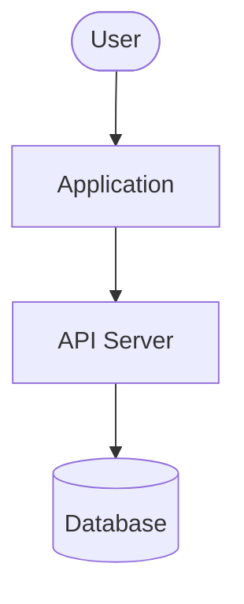

## System Design Review Workflow

1. Read the feature issue + any linked specs or prior ADRs

2. Produce a Mermaid context diagram:

3. Fill out the integration risk table:

| Boundary | Direction | Protocol | Risk | Mitigation |
|----------|-----------|----------|------|------------|

4. List open questions (anything requiring a decision before build starts)

5. Post the diagram + risk table + open questions as a comment on the issue
